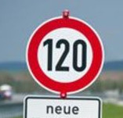

# Udacity Self-Driving Car Engineer Nanodegree
## Traffic Sign Recognition using Deep Learning

### Overview

This project creates and trains a LeNet 5 Architecture based deep convolutional neural network from scratch, with the task of classifying German traffic signs using the [German Traffic Sign Dataset](http://benchmark.ini.rub.de/?section=gtsrb&subsection=dataset). The trained model is subsequently tested on German traffic signs found on the web. 

### Dependencies

This project requires **Python 3.5** and the following Python libraries installed:

- [Jupyter](http://jupyter.org/)
- [NumPy](http://www.numpy.org/)
- [SciPy](https://www.scipy.org/)
- [scikit-learn](http://scikit-learn.org/)
- [TensorFlow](http://tensorflow.org)
- [PIL](http://www.pythonware.com/products/pil/)
- [OpenCV](http://opencv.org/)

### Dataset

This project uses the German Traffic Sign Dataset. A pickled version that has images resized to 32x32 is available [here](https://d17h27t6h515a5.cloudfront.net/topher/2016/October/580d53ce_traffic-sign-data/traffic-sign-data.zip). The pickle file was used as the raw data for this project.

### How to run

You can step through the Jupyter Notebook at `Traffic_Sign_Classifier.ipynb`, or you can read the HTML export of the notebook at `Traffic_Sign_Classifier.html`.

The model has been trained and test on Amazon AWS EC2 Service.